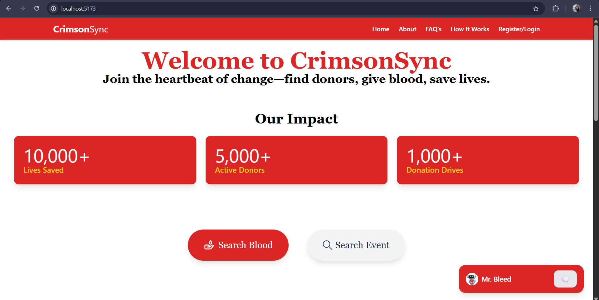
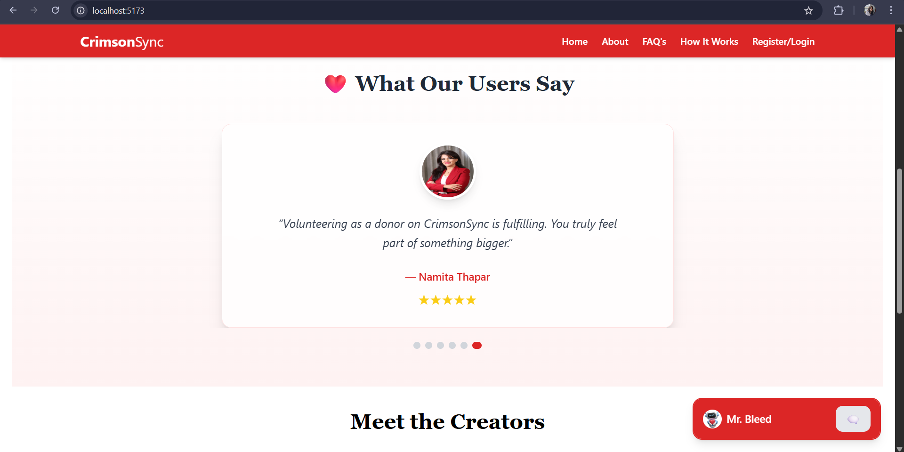
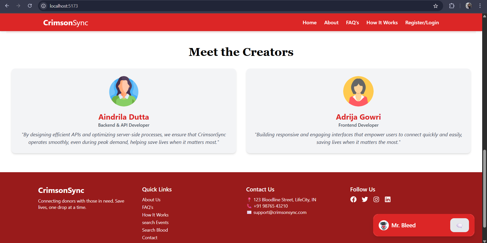

# 🩸 CrimsonSync E-Blood Bank

## 📖 Overview

**CrimsonSync** is a full-stack web platform built to **digitize and simplify the process of blood donation** by connecting individuals in need of blood with potential donors based on **blood type and city**. The platform fosters a responsive healthcare ecosystem by allowing users to **request or donate blood**, view **nearby donation events**, and receive real-time updates — all through a secure and user-friendly interface.

Every registered user in CrimsonSync can act as a **recipient and/or donor**, eliminating the need for separate roles. With a built-in **notification system**, users are alerted instantly about matching requests or upcoming events based on their city.

## 🌟 Key Features

- 🧬 **Blood Type & City Matching** – Instantly find or be matched with users having a compatible blood type in the same city.
- 📍 **Nearby Event Discovery** – View upcoming blood donation camps based on your city/location.
- 🔔 **Notification-Based System** – Receive alerts for matching donation requests, blood availability, and upcoming events.
- 🔐 **Role-Agnostic User Model** – A single user profile can both request and donate blood.
- 🧾 **Donation & Request History** – Track your donation and request history through a streamlined dashboard.
- 🛡️ **Secure Login & Access Control** – Authentication powered by JWT with protected routes for sensitive data.
- 🤖 **Chatbot Assistant** – Get instant answers to common app-related queries via an integrated chatbot.

## 🛠️ Tech Stack

- **Frontend**: React.js
- **Backend**: Node.js + Express.js
- **Database**: MongoDB
- **Authentication**: JWT

## 📸 Screenshots

### 🏠 Home Page

  
  

### 🔍 Search Donor

### 🩸 Request Blood

### 🔔 Notifications

## 🚀 Future Enhancements

- 💬 **Real-time Chat** – Enable real-time chat-based communication between matched users for better coordination.
- ❌ **Blood Request Cancellation** – Allow users to cancel active blood requests if no longer needed.
- ⏱️ **Urgency-Based Requests** – Classify blood requests by urgency (e.g., “within 2 hours”, “today”, “this week”) for prioritized visibility.
- 📱 **Mobile App** – A companion app for real-time notifications and on-the-go access.
- 🗺️ **Map-Based Event Visualization** – Display donation camps and event locations using interactive maps.
- 📤 **Email/SMS Notification Integration** – Notify users about critical blood needs via external communication channels.

## 📬 Contact

> 📧 Email: [your_email@example.com]  
> 🧑 Maintainer: [Your Name or Team Name]

---

Made with ❤️ to save lives and simplify blood donation.
