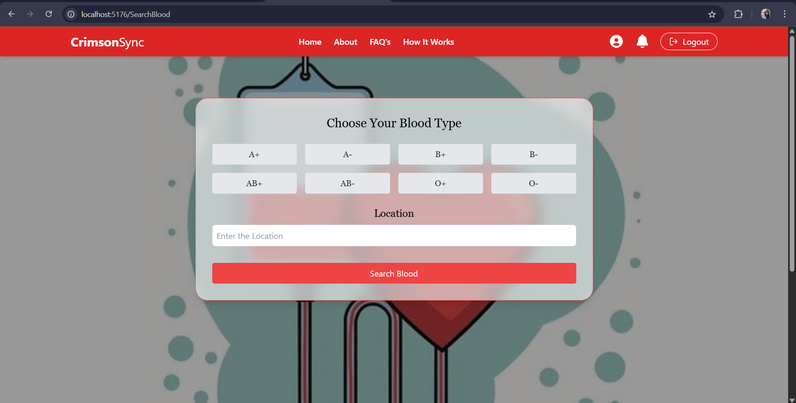

# 🩸 CrimsonSync E-Blood Bank

## 📖 Overview

**CrimsonSync** is a full-stack web platform built to **digitize and simplify the process of blood donation** by connecting individuals in need of blood with potential donors based on **blood type and city**. The platform fosters a responsive healthcare ecosystem by allowing users to **request or donate blood**, view **nearby donation events**, and receive real-time updates — all through a secure and user-friendly interface.

Every registered user in CrimsonSync can act as a **recipient and/or donor**, eliminating the need for separate roles. With a built-in **notification system**, users are alerted instantly about matching requests or upcoming events based on their city.

## 📋 Table of Contents

1. [Overview](#overview)
2. [Key Features](#key-features)
3. [Tech Stack](#tech-stack)
4. [Screenshots](#screenshots)
   1. [Home Page](#home-page)
   2. [Register & Login Pages](#register--login-pages)
   3. [About & FAQ](#about--faq)
   4. [How Does It Work](#how-does-it-work)
   5. [Search Features](#search-features)
   6. [User Profile](#user-profile)
   7. [Notifications](#notifications)
   8. [Admin Functionalities](#admin-functionalities)
5. [Future Enhancements](#future-enhancements)
6. [Contact](#contact)

---

## 🌟 Key Features

- 🧬 **Blood Type & City Matching** – Instantly find or be matched with users having a compatible blood type in the same city.
- 📍 **Nearby Event Discovery** – View upcoming blood donation camps based on your city/location.
- 🔔 **Notification-Based System** – Receive alerts for matching donation requests and blood availability.
- 🔐 **Role-Agnostic User Model** – A single user profile can both request and donate blood.
- 🧾 **Donation & Request History** – Track your donation and request history through a streamlined dashboard.
- 🛡️ **Secure Login & Access Control** – Authentication powered by JWT with protected routes for sensitive data.
- 🤖 **Chatbot Assistant** – Get instant answers to common app-related queries via an integrated chatbot.

## 🛠️ Tech Stack

- **Frontend**: React.js
- **Backend**: Node.js + Express.js
- **Database**: MongoDB
- **Authentication**: JWT

---

## 📸 Screenshots

### 🏠 Home Page

  
  

#### 🔐 Register Page

#### 🔑 Login Page

### ℹ️ About & FAQ

#### 🧾 About Us Page

#### ❓ FAQ Page

### 🚀 How Does It Work?

CrimsonSync is designed to make blood donation and request processes simple and efficient. Here’s a step-by-step guide to how it works.

  
  

### 🔎 Search Features

#### 📍 Search Blood

#### 📅 Search Events

### 📅 View Events

#### 🗓️ Event Listings

### 👤 User Profile

#### 🩸 Profile Details & Blood Donation History

  
  

- **Recipient History**: List of blood requests made by the user as a recipient.
- **Donor History**: List of past donations made by the user.
- **Personal Details**: Information like name, username, location, contact info, etc.

---

### 🔔 Notifications

#### 📩 After Recipient Sends Request

- **Recipient Notification**: "Your blood request has been successfully submitted."

#### 👀 After Donor Views Request

- **Donor Notification**: "You have a new blood request. Please review the details."

#### ✅ After Donor Accepts Request

- **Recipient Notification**: "Your blood request has been accepted. Donor details are now available."

#### 💌 After Recipient Receives Confirmation

- **Donor Notification**: "You have successfully confirmed the donation."

### 👑 Admin Functionalities

#### 📈 Dashboard Overview

- The admin dashboard provides a comprehensive overview of the system, including key metrics such as total users, donation events, and overall statistics.

#### 👥 User Management

##### View Users

- Admins can view a list of all registered users.

##### Search Users

- Admins can search users by various parameters such as name, username, or role (donor/recipient).

---

#### 🧑‍💼 Admin Management

##### View Admins

- Admins can view a list of all other admins.

##### Search Admins

- Admins can search for other admins based on their username or email.

---

#### 📅 Event Management

##### Create New Event

- Admins can create new donation events by providing details such as date, location, and venue requirements.

##### View Events by City and Year (Chart)

- Admins can view events by city and year using an interactive chart for better insights.

---

### 👤 Admin Profile

#### 🛠️ Admin Profile Details

- Admins can view and update their profile details like username, email, and contact information.

---

## 🚀 Future Enhancements

- 💬 **Real-time Chat** – Enable real-time chat-based communication between matched users for better coordination.
- ❌ **Blood Request Cancellation** – Allow users to cancel active blood requests if no longer needed.
- ⏱️ **Urgency-Based Requests** – Classify blood requests by urgency (e.g., “within 2 hours”, “today”, “this week”) for prioritized visibility.
- 📱 **Mobile App** – A companion app for real-time notifications and on-the-go access.
- 🗺️ **Map-Based Event Visualization** – Display donation camps and event locations using interactive maps.
- 📤 **Email/SMS Notification Integration** – Notify users about critical blood needs via external communication channels.

## 📬 Contact

> 📧 Email: [aindriladutta392@gmail.com]  
> 🧑 Maintainer: Aindrila Dutta  

> 📧 Email: [adtani.gowri@gmail.com]  
> 🧑 Maintainer: Adrija Gowri

---

Made with ❤️ to save lives and simplify blood donation.
